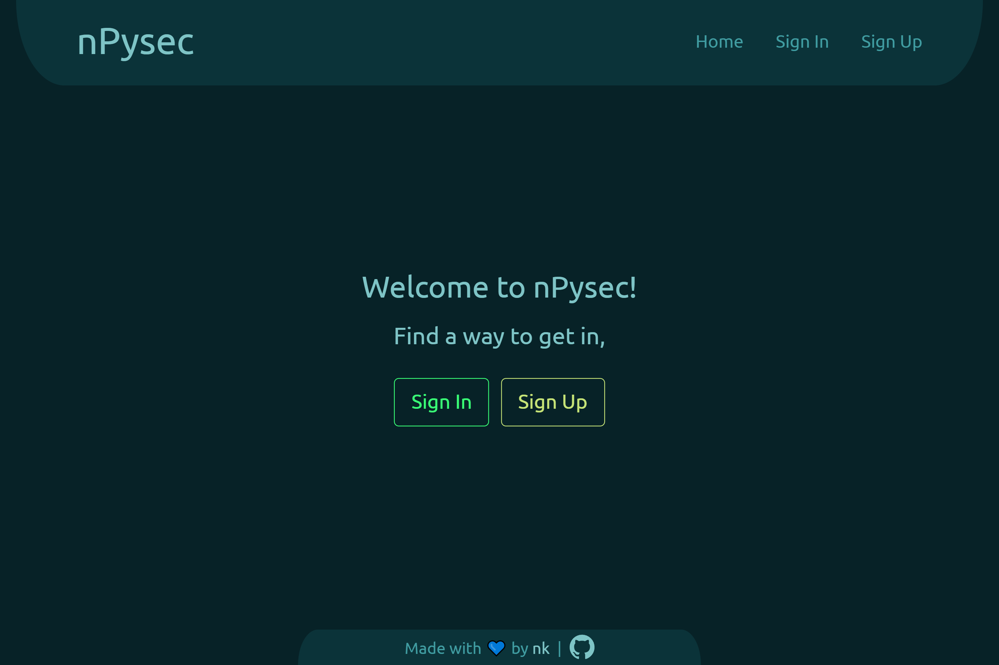
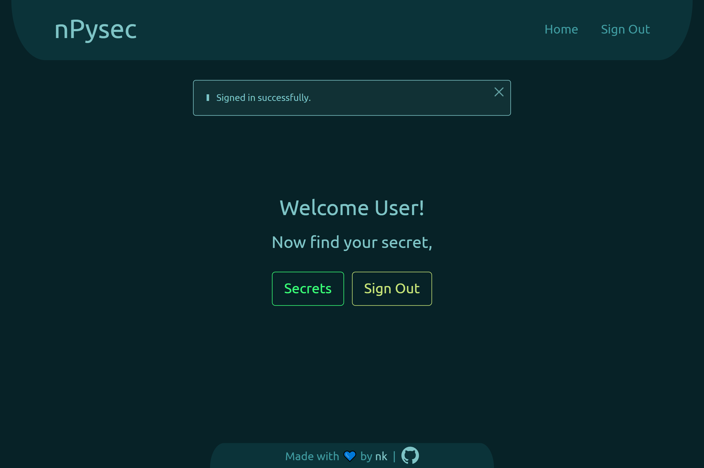
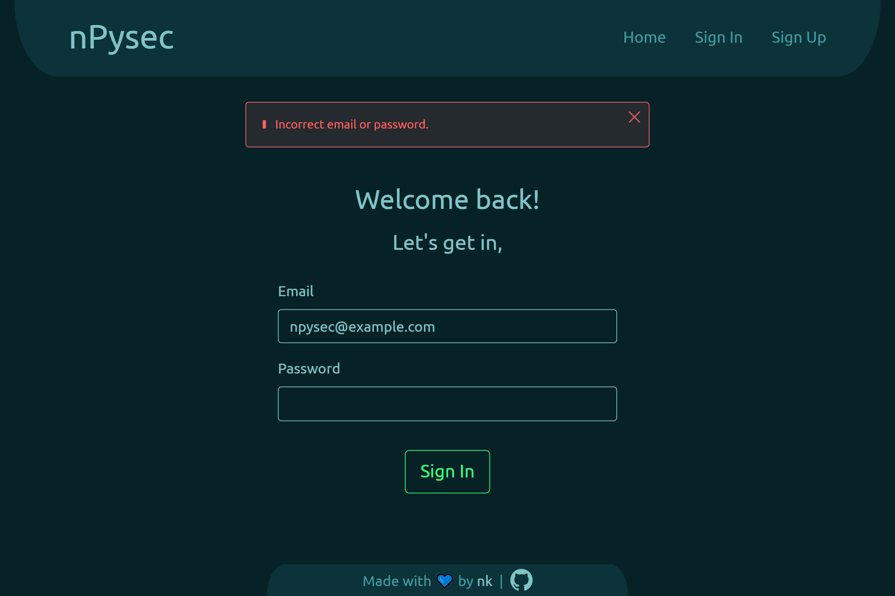

    
    <h1 align="center">nPysec</h1>
    
A flask app to serve a file with authentication.

## Tools
- HTML
- CSS: Bootstrap
- Python: Flask, uwsgi
- PostgreSQL
- Heroku

## Features
- User authentication.
- CSRF protection.
- Session protection.
- Content security policy.
- Passwords are salted and hashed.
- User session management.
- PostgreSQL integration.
- Enhanced flash/feedback messages.
- Account expiry feature.

## Preview

  

  

